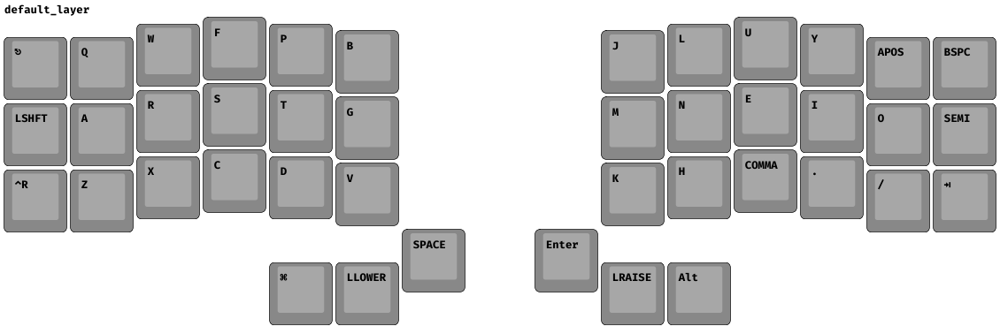
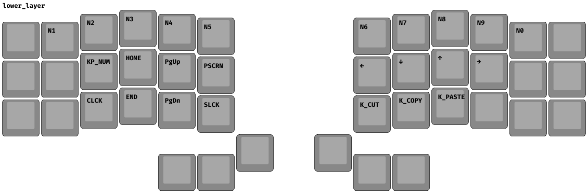
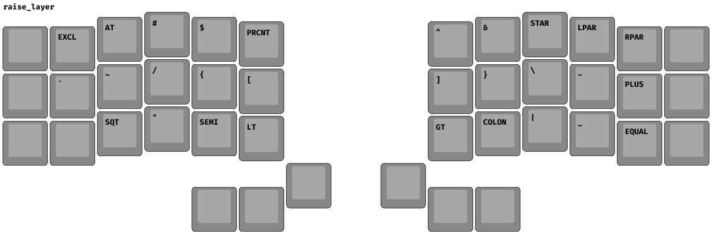
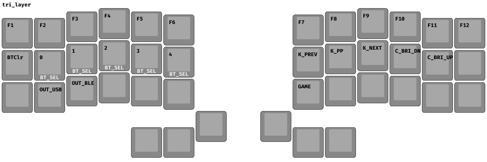
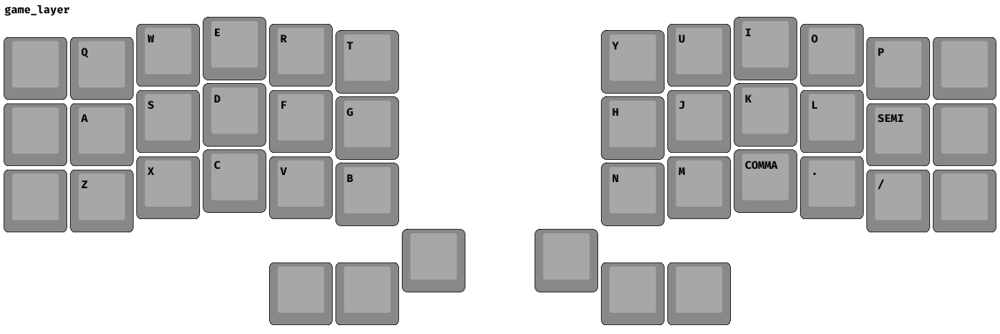

## corne keymap
this repo contains source for my corne v3

features include:

- [x] qwerty layout
- [x] 42 key layout, utilizing 6 extra keys
- [x] all non essential keys moved to tri layer
- [x] gaming layer with home-row mods disabled
- [x] zmk studio support (unlock via tri layer, bottom left)
- [x] timeless home-row mods (gacs, cross-hand only)

### macos
the keymap is windows/linux shaped: homerow mods are gacs (pinky to index: gui,
alt, ctrl, shift) and cut/copy/paste on the lower layer use ctrl. on a mac, swap
ctrl and cmd for this keyboard only via system settings > keyboard > keyboard
shortcuts > modifier keys, rather than forking the keymap.

### firmware version
`config/west.yml` pins zmk to a `main` commit rather than a tag, because no
tagged release ships zephyr 4.1 yet (`v0.3` is still on 3.5). `zmk-rgbled-widget`
and the github actions workflow are pinned to match; bump all three together.

board id is `xiao_ble//zmk` — the old `seeeduino_xiao_ble` name was removed in
the zephyr 4.1 / hwmv2 migration.

### images
- base 
- lower 
- raise 
- tri 
- game 

### license and credits
mit 2024

credits:
- [zmk.dev](https://zmk.dev/)
- [github.com/MrMarble/zmk-viewer](https://github.com/MrMarble/zmk-viewer/)
- [qmk `info.json`](https://config.qmk.fm/#/splitkb/aurora/corne/rev1/LAYOUT_split_3x6_3/)
