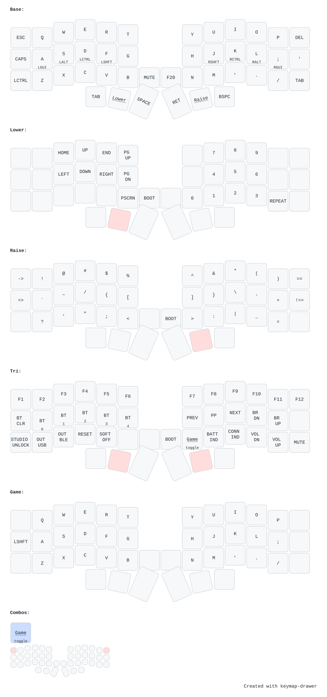

## corne keymap

this repo contains source for my corne v3

features include:

- [x] qwerty layout
- [x] 42 key layout, utilizing 6 extra keys
- [x] all non essential keys moved to tri layer
- [x] gaming layer with home-row mods disabled
- [x] zmk studio support (unlock via tri layer, bottom left)
- [x] timeless home-row mods (gacs, cross-hand only)
- [x] lower: numpad on right, arrow keys (inverted-t) on left
- [x] raise: programming symbols

### macos

the keymap is windows/linux shaped: homerow mods are gacs (pinky to index: gui,
alt, ctrl, shift) which puts ctrl on middle finder.

**on a mac (one-time setup)**

swap ctrl and cmd, both left and right variants, using karabiner-elements
so it reads: ctrl / option / command / shift from pinky to index

_note_: home-row mods only fire cross-hand, use dedicated ctrl key for same hand
also, right encoder emits `F20`, set it up as per requirements

### firmware version

`config/west.yml` pins zmk to a `main` commit rather than a tag, because no
tagged release ships zephyr 4.1 yet (`v0.3` is still on 3.5). `zmk-rgbled-widget`
and the github actions workflow are pinned to match; bump all three together.

board id is `xiao_ble//zmk` — the old `seeeduino_xiao_ble` name was removed in
the zephyr 4.1 / hwmv2 migration.

### keymap

- 

### license and credits

mit 2024

credits:

- [zmk.dev](https://zmk.dev/)
- [github.com/caksoylar/keymap-drawer](https://github.com/caksoylar/keymap-drawer/)
