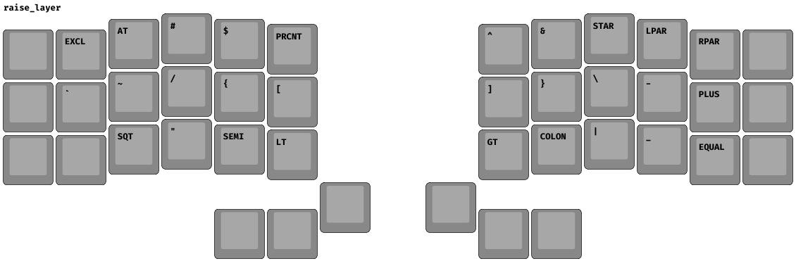

## corne keymap
this repo contains source for my corne v3

features include:

- [x] colemak-dh layout
- [x] 42 key layout, utilizing 6 extra keys
- [x] all non essential keys moved to tri layer
- [x] qwerty game layer
- [ ] timeless home-row mods

### images
- base 
- lower 
- raise 
- tri 
- game 

### license and credits
mit 2024

credits:
- [zmk.dev](https://zmk.dev/)
- [github.com/MrMarble/zmk-viewer](https://github.com/MrMarble/zmk-viewer/)
- [qmk `info.json`](https://config.qmk.fm/#/splitkb/aurora/corne/rev1/LAYOUT_split_3x6_3/)
